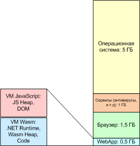

# Сравнение React с Blazor WebAssembly

Не секрет, что при работе React-приложений, значительные вычислительные ресурсы расходуются впустую. Это обусловлено следующими факторами:

- языковыми особенностями JavaScript и Runtime V8
- построением RenderTree каждый раз при изменении состояния
- сравнение текущего и предыдущего RenderTree c "отбрасыванием" части результатов вычислений

Для оптимизации работы приложения в React используются различные трюки, связанные с кэшированием (мемоизация).

Blazor WebAssembly, потенциально, может быть лишен части из этих недостатков:

- wasm обеспечивает почти нативную производительность для чисто вычислительных задач
- используется другая модель реагирования на изменения состояний, по сути, реализован механизм автоматического обновления состояний компонентов, который не требует активных действий пользователя почти никогда

Цель данного исследования - выяснить, действительно ли есть существенные преимущества при использовании wasm (и Blazor, как компилятора в wasm). Также важным является сравнение вычислительной нагрузки, используемой для достижения схожих целей в React-приложениях и Blazor-приложениях.

Для сравнения, скорее всего, разумно использовать встроенные в Chrome метрики производительности приложения.

## Сильная и слабая стороны React

В видео под названием "React победил в битве frontend-фреймворков. Он с нами навсегда" Миши Ларченко высказывается мнение о том, что React занял доминирующее положение в разработке frontend-приложений и благодаря ИИ эту позицию у React уже невозможно отнять. Михаил ссылается на результаты различных исследований, в которых около 70% SPA используют React, и около 20% за Angular (в основном, корпоративный мир). Есть ещё Vue.js и Svelte, а также огромное количество попыток переосмысления React (Preact, Solid, и т.д.). Однако их доля на уровне статистической погрешности.

В условиях лавинообразного развития ИИ, новые разработчики, задавая вопрос ChatGPT, какой фреймворк следует использовать, будут гарантированно получать рекомендацию - React. Точно такой же результат будут получать программисты, которые интересуются размером community. Это приведёт к тому, что во временем, доминирование React станет близким к 100%.

Миша Ларченко высказывает мнение, что с одной стороны это здорово, т.к. появляется индустриальный стандарт - все делают похожую работу одним и тем же способом. С другой стороны, доминирование означает смерть инновациям и глубокую стагнацию. Что будет заводить индустрию в тупик.

Я эту позицию разделяю на 100%.

Та же тема раскрывается в статье [React-монополист: как мы сами убиваем развитие фронтенда](https://habr.com/ru/articles/948072/) by Loren Stewart. Оригинал статьи на английском языке доступен на Telegram-канале "JavaScript for Devs".

Основная идея статьи выражается в следующих предложениях: "_React больше не побеждает по техническим причинам. Сегодня он побеждает просто потому, что стал выбором «по умолчанию». И именно этот факт тормозит инновации во всей frontend‑экосистеме._"

В статье отмечается, что действительно инновационным framework-ам крайне сложно найти свой путь к разработчику, несмотря на то, что они обладают в многом лучшими потребительскими свойствами:

- Svelte полностью убирает накладные расходы фреймворка на этапе компиляции
- Solid даёт тонкую реактивность без налога виртуального DOM
- Qwik обеспечивает мгновенный старт благодаря подходу _resumability_

>Update декабрь 2025: очередная волна критический уязвимостей, что уже становится новой "нормой". Статей об уязвимостях много. Рекомендуется ознакомиться с [Критическая уязвимость безопасности в React Server Components](https://habr.com/ru/articles/973050/) by misha98857. Найденная уязвимость позволяет выполнять код на сервере удалённо, без аутентификации пользователя. Уязвимость является критичной и, по статистической информации, уязвимость подтверждена не менее, чем для 77 тысяч IP-адресов с серверными приложениями. Затронуты: Next.js, React Router, Expo, и другие. Исправление вышло через 6 дней, после сообщения о найденной уязвимости.
>
>К сожалению, это далеко не первая критичная уязвимость, найденная в экосистеме React - в течение года их было уже несколько. Контролировать узявимости, практически, невозможно. Чаще всего зловреды встраиваются в небольшой npm-пакет, который используется в качестве зависимости в более популярных пакетах. Поскольку в npm размещается миллионы пакетов и создавать их может кто-угодно, быстрый аудит зависимостей, практически, невозможен.
>
>Крупные IT-компании могут использовать консервативные репозитарии пакетов-зависимостей, альтернативных npm. Такие репозитарии хранят проверенное подмножество npm-пакетов. Обновление/добавление пакета осуществляется после строгово аудита. Подход нне плох, с точки зрения информационной безопасности, но услуга платная и обновление компонентов может прийти с сильным опозданием, или вообще не появится в репозитарии.
>
>Следует заметить, что это не только проблема npm-пакетов JavaScript/TypeScript. Точно такая же проблема существует, например, в PyPI и создаёт риск заражения огромного количества Python-приложений.

К слабой стороне Blazor можно отнести ограничение объёма heap-памяти для Wasm-приложений (возможно, что не только для wasm). Это вполне реальная проблема, которая привела к критичным сбоям в единственной промышленном решении на Blazor в компании. Скорее всего, управлять объёмом доступной heap-памяти, в определённых границах, можно, но то, что проблема возникла в первом же проекте говорит о том, что инструмент требует ответсвенного отношения к кодированию и оптимизации кода уже на ранних стадиях разработки продукта. По экспериментально подтверждённым данным, объём heap-памяти, доступной для клиентского Blazor-приложения составляет 1 ГБ. Возможно, объём можно увеличить, однако опытные разработчики клиентских Blazor-приложений, наоборот, снижают доступный объём heap-памяти для проверки эффективности приложений.

Одной из метрик объёма heap-памяти является количество занятой в данный момент managed memory (.NET). Получить данные можно в любой момент времени используя метод GetTotalMemory() сборщика мусора:

```csharp
long memoryUsed = GC.GetTotalMemory(false);
Console.WriteLine($"Managed memory: {memoryUsed / 1024 / 1024} MB");
```

Для автоматически сгенерированного изображения, стартовый размер занятой памяти будет равен 4 МБ.

Получить общий размер доступной памяти можно используя вызов:

```csharp
var gcInfo = GC.GetGCMemoryInfo();
long totalAvailableBytes = gcInfo.TotalAvailableMemoryBytes;
```

В общем случае, браузер ограничивает максимальный размер Heap-а 2 ГБ на один TAB в браузере.

Для машины с 8 ГБ ОЗУ ориентировочная схема распределения памяти может выглядеть следующим образом:



## Резюмируя, чем отличаются React и Blazor

По факту, получается, что главное отличие React от Blazor состоит в следующих вещах:

- Blazor сам отслеживает изменение состояния компонента и делает ре-рендеринг. Однако иногда он ошибается и следует использовать StateHasChanged() в качестве компенсационной меры
- Blazor приложение может быть скомпилировано в wasm (AOT-компиляция), а затем в машинный код. React компилируется в JavaScript, который может быть скомпилирован в машинных код (JIT-компиляция)
- Blazor - экосистема C#/.NET, React - TypeScript/V8
- Blazor требует существенно меньше знать разных трюков, таких как _immutable state changing_ - корректного изменения состояния, выраженного в коллекциях (массивах, списках, и т.д.) с использованием _spread operator_ (см. `setGameBoard((prevGameBoard) => {`). Также, для корректной работы JavaScript-приложений требуется очень внимательно использовать контейнеры в оперативной памяти. Неаккуратное использование immutable-конструкций может приводить к крайне тяжело локализуемым ошибкам. Довольно часто приходится прибегать к "глубокому" копированию контейнеров, чтобы избежать ошибок. К счастью, spread operator позволяет разрабатывать лаконичные конструкции.

Все остальные различия не кажутся существенными.

Первый пункт кажется крайне существенным. Опытные React-разработчики стремятся минимизировать количество используемых состояний (useState), используя т.н. derived states (вычисляемые состояния). Идеальным случаем является выведение вычисляемых состояний из "одного источника правды" - единственного состояния (которым может являться контейнер данных, например, массив). Это означает, что опытные разработчики React-приложений могут (и делают это) осуществить очень мощную оптимизацию пользовательского интерфейса приложения вручную. В Blazor управлением состояниями занимается Blazor, т.е. оптимизация осуществляется автоматически и у программиста не очень много возможностей оптимизации. Возможность оптимизации рендеринга - очень мощный довод в пользу React.

Однако, по первому же пункту можно заметить, что Blazor выполняет tracking состояния параметров, а для private-переменных в секции `@code` tracking не осуществляется. Т.е. использование атрибута `Parameter`, близко по смыслу к useState:

```csharp
@code {
    // Tracked: при изменении значения будет выполнен re-render
    [Parameter]
    public string DisplayName { get; set; }
```

Также заметим, что Blazor позволяет определять специфическую логику rerendering-а для компонента посредством `ShouldRender()`.

AOT-компиляция может быть как плюсом, так и минусом. К сожалению, сборка wasm-приложений занимает значительное количество времени, больше, чем транспиляция соразмерного TypeScript-проекта. При этом эффективность нативного приложения может мало отличаться от приложения, интерпретируемого из байт-кода. Этот пункт в сравнении, не даёт перевес какой-либо из сторон при разработке типовых приложений.

Последний пункт - явный плюс Blazor, т.к. он сильно снижает требования к программисту; фреймворк очень многое делает за разработчика. Плата за удобство для разработчика - худшая эффективность кода.

>Важно заметить, что применение как React, так и Blazor может быть критичным переусложнением разрабатываемой системы. Подобные инструменты подходят для разработки высоконагруженных приложений со сложной версткой и комплексной client-side логикой. В более простых случаях, использование этих библиотек может быть не только избыточным, но даже может приводить к кратному увеличению трудозатрат на разработку продукта.

## Выбор библиотеки компонентов

Рекомендуется для ознакомления статья "Fluent UI vs MudBlazor vs Radzen: Best Blazor UI in 2025" by Aliaksandr Marozka. Резюме для занятых программистов:

- Нужен быстрый старт и подробная документация - MudBlazor
- Нужно выглядеть как Microsoft, поддержка accessibility (a11y) и нужны design patterns - Fluent UI Blazor
- Нужны мощнейшие таблицы (DataGrid) для тяжелых CRUD и EF - Radzen.Blazor

В статье приведена сводная таблица с оценкой ключевых свойств, с учётом из весов: Fluent UI Blazor - 36 баллов, MudBlazor - 42, Radzen.Blazor - 45.

Единственное свойство, в котором Fluent UI Blazor оказался на первом месте - a11y, на равне с другими - mobile responsiveness. По всем остальным пунктам - проигрывает.

## Создание базового приложения Blazor WebAssembly

[Официальный сайт](https://mudblazor.com/) MudBlazor содержит, в том числе, инструкцию по установке библиотеки.

Установить шаблоны приложений MudBlazor можно следующим образом:

```shell
dotnet new install MudBlazor.Templates
```

Пакет с MudBlazor находится в репозитарии NuGet и называется **MudBlazor**.

Сгенерировать проект с поддержкой Blazor WebAssembly можно командой:

```shell
dotnet new mudblazor --interactivity WebAssembly --name MyApplication --all-interactive
```

Запуск приложения:

```shell
dotnet run
```

Доступ к библиотекам MudBlazor осуществляется через одноименный сервис, который активируется в файле "Program.cs":

```csharp
builder.Services.AddScoped(sp => new HttpClient { BaseAddress = new Uri(builder.HostEnvironment.BaseAddress) });

// Добавляем сервисы MudBlazor
builder.Services.AddMudServices();

await builder.Build().RunAsync();
```

Из файла "index.html" в папке "wwwroot" загрузка стилей MudBlazor осуществляется следующим образом:

```html
<link href="_content/MudBlazor/MudBlazor.min.css" rel="stylesheet" />
```

Важно заметить, что ссылка "_content/MudBlazor" является виртуальной - это не папка на физическом диске, а запрос к сервису, для предоставления контента сервиса.

После этого можно начинать использовать стили MudBlazor, например, добавить кнопку:

```csharp
<MudButton Color="Color.Primary" Variant="Variant.Filled">Submit</MudButton>
```

Следует заметить, что для MudBlazor есть специализированный [Playground](https://try.mudblazor.com/), который позволяет проверять элементы дизайна и код online.

## MudTable и DataGrid

В MudBlazor есть два разных органа управления, используемых для представления табличных данных: DataGrid и MudTable.

В DataGrid можно добавлять слева отдельное поле для выбора конкретной строки таблицы. Соответственно, инструмент предоставляет возможность выполнения групповых операций.

Table поддерживает возможность выбора строки таблицы для выполнения дальнейших операций с ней. Для этого необходимо создать ссылку на выбранный элемент (приватный член-класса) и осуществить связывание с ним:

```csharp
<MudTable Items="forecasts" Hover="true" SortLabel="Sort By" Elevation="0" AllowUnsorted="false"
            @bind-SelectedItem="selectedItem">
    ...
</MudTable>
<MudSpacer />
<MudText Class="align-self-center d-inline">Selected: @selectedItem?.Summary</MudText>

@code {
    private WeatherForecast? selectedItem = null;
}
```

В приведённом выше примере, мы выводим информацию из поля "Summary" текущего выбранного элемента.

## Модальные диалоги - MudBlazor

Предположим, что нам необходимо добавить в приложение модальный диалог. Для этого мы создаём файл "WeatherInfo.Razor" и реализуем в нём диалог:

```csharp
<MudDialog>
    <TitleContent>
        Dialog Title
    </TitleContent>
    <DialogContent>
        Dialog Content
    </DialogContent>
    <DialogActions>
        <MudButton OnClick="Cancel">Cancel</MudButton>
        <MudButton Color="Color.Primary" OnClick="Submit">Ok</MudButton>
    </DialogActions>
</MudDialog>
@code {
    [CascadingParameter]
    private IMudDialogInstance MudDialog { get; set; }

    private void Submit() => MudDialog.Close(DialogResult.Ok(true));

    private void Cancel() => MudDialog.Cancel();
}
```

Далее на форме, которая должна содержать диалог, добавляем: сервис DialogService, кнопку для активации диалога и функцию для его отображения:

```csharp
@inject IDialogService DialogService

<MudButton @onclick="OpenDialogAsync" Variant="Variant.Filled" Color="Color.Primary">
    Open Simple Dialog
</MudButton>
@code {

    private Task OpenDialogAsync()
    {
        var options = new DialogOptions { CloseOnEscapeKey = true };

        return DialogService.ShowAsync<DialogUsageExample_Dialog>("Simple Dialog", options);
    }
}
```

Если компонент размещён в отдельной папке (например, "Components"), то может потребоваться добавить директиву `@using`:

```csharp
@using MudBlazorApp.Client.Components
```

## Добавление в модальный диалог полей

Достаточно добавить описание поля в верстку, создать атрибуты в компоненте и добавить Binding.

Верстка с Binding-ом:

```csharp
<DialogContent>
    <MudContainer Style="max-height: 300px; overflow-y: scroll">
        <MudTextField @bind-Value="Field1Value"
                        Label="Field 1"
                        Variant="Variant.Outlined"
                        Margin="Margin.Dense" />
        <MudTextField @bind-Value="Field2Value"
                        Label="Field 2"
                        Variant="Variant.Outlined"
                        Margin="Margin.Dense" />
    </MudContainer>
</DialogContent>
```

Определяем дополнительные поля, а также, при выполнении Submit, возвращаем введённые значения посредством вспомогательной модели `DialogResultModel`:

```csharp
@code {
    [CascadingParameter]
    private IMudDialogInstance MudDialog { get; set; }

    [Parameter]
    public string Field1Value { get; set; } = string.Empty;

    [Parameter]
    public string Field2Value { get; set; } = string.Empty;

    private void Submit()
    {
        var result = new DialogResultModel
        {
            Field1 = Field1Value,
            Field2 = Field2Value
        };

        MudDialog.Close(DialogResult.Ok(result));
    }

    private void Cancel() => MudDialog.Cancel();
}
```

Модель может быть определена, например, в классе DialogResultModel:

```csharp
public class DialogResultModel
{
    public string Field1 { get; set; } = string.Empty;
    public string Field2 { get; set; } = string.Empty;
}
```

### Вызов диалога из родительского класса

Для целей отладки, можно добавить в родительский элемент два поля для отображения результатов работы модельного диалога. Это временная мера.

Добавляем поля в верстку:

```csharp
<MudSpacer />
<MudText Typo="Typo.body1">Field 1 Result: @field1Result</MudText>
<MudText Typo="Typo.body1">Field 2 Result: @field2Result</MudText>
```

Также добавляет атрибуты в код:

```csharp
@code {
    // Поля для отображения на экране введённых параметров
    private string field1Result = string.Empty;
    private string field2Result = string.Empty;
```

Если нам нужно передать данные в модельный диалог при его открытии, то нам нужно использовать контейнер `DialogParameters`.

Предыдущий код выглядел так:

```csharp
private Task OpenDialogAsync()
{
    var options = new DialogOptions { CloseOnEscapeKey = true };

    return DialogService.ShowAsync<DialogUsageExample_Dialog>("Simple Dialog", options);
}
```

Код с передачей параметров и обработкой результатов выглядит так:

```csharp
private async Task OpenModalAsync()
{
    var options = new DialogOptions { CloseOnEscapeKey = true };

    var parameters = new DialogParameters
    {
        ["Field1Value"] = "Initial Value 1",
        ["Field2Value"] = "Initial Value 2"
    };

    // Отображаем диалог
    var dialog = await DialogService.ShowAsync<WeatherInfo>("Simple Dialog", parameters, options);
    var result = await dialog.Result;

    // В случае, если пользователь подтвердил введённые значения, сохраняем их
    if (!result.Canceled && result.Data is DialogResultModel data)
    {
        field1Result = data.Field1;
        field2Result = data.Field2;

        // Выполняем Re-rendering экрана
        StateHasChanged();
    }
}
```

### Что можно было бы сделать по другому?

Мы могли бы не создавать модель DialogResultModel, а определить её динамически. Т.е. при выполнении функции Submit мы могли бы просто вернуть анонимный объект:

```csharp
private void Submit()
{
    var result = new { Field1 = Field1Value, Field2 = Field2Value };
    MudDialog.Close(DialogResult.Ok(result));
}
```

Соответственно, мы может обработать динамический объект в родительском компоненте, вручную:

```csharp
var result = await dialog.Result;

if (!result.Canceled && result.Data != null)
{
    dynamic data = result.Data;
    field1Result = data.Field1;
    field2Result = data.Field2;
    StateHasChanged();
}
```

Приведённая выше альтернатива уменьшает количество кода, но делает код более хрупким - не рекомендуется к использованию.

### Можно изменять данные таблицы через ссылку

В нашем примере есть ссылка на текущую выбранную строку таблицы:

```csharp
private WeatherForecast? selectedItem = null;
```

Мы можем использовать её для изменения данных в таблице:

```csharp
if (!result.Canceled && result.Data is DialogResultModel data)
{
    // Сохраняем данные в таблице через ссылку на элемент (selectedItem)
    if( Int32.TryParse(data.Field1, out var value))
    {
        selectedItem.TemperatureC = value;
    }

    selectedItem.Summary = data.Field2;

    // Выполняем Re-rendering экрана
    StateHasChanged();
}
```

## Изменяемый список

Если у нас есть потребность добавлять в таблицу данные динамически, мы можем использовать не обычный массив, а список:

```csharp
private List<WeatherForecast> forecasts = new();
```

Производительность List<> ниже, чем у обычного массива, но для большинства задач это не будет иметь значимого негативного эффекта.

Добавить новый элемент в таблицу можно так:

```csharp
forecasts.Add(new WeatherForecast
{
    Date = DateOnly.FromDateTime(DateTime.Now),
    TemperatureC = tempearature,
    Summary = data.Field2
});

StateHasChanged();
```

Следует заметить, что при вызове StateHasChanged() из асинхронного кода, или отдельного потока, необходимо оборачивать его в InvokeAsync():

```csharp
await InvokeAsync(StateHasChanged);
```

## Чем модель Blazor лучше модели React

Работа с модальными диалогами гораздо более очевидная и простая, чем в React.

В React мы определяем атрибуты в родительском элементе и передаём их через props, т.е. связь между вызывающим кодом и модальным диалогом, явным образом, описывается версткой. Это декларативный подход, но он создаёт сцепленность, "жесткую связь".

В Blazor вызывающий код и MudDialog обмениваются объектами (моделями) и этот код никак на верстке не сказывается. Этот подход больше похож на императивный, более понятный и не создаёт жёсткую связь верстки двух компонентов.

Изменение данных в таблице осуществляется наиболее естественным образом - через ссылку, которая автоматически настраивается через _binding_. Также можно очень эффективно добавлять новые элементы в таблицу, буквально, вставляя новые элементы в массив. В JavaScript тоже позволяет сформировывать новый массив, но синтаксическая конструкция получается более сложной и ресурсозатратной.

Однако, следует обратить внимание, что Blazor требует выполнения Re-rendering-а вручную, см.: `StateHasChanged()`. Вызов StateHasChanged() форсирует перерисовку пользовательского интерфейса. С другой стороны, в React мы так же должны вызвать wrapper-функцию, сгенерированную React, чтобы вызвать re-rendering. Для примера ниже приведён код на TypeScript:

```ts
const [tableData, setDataTable] = useState<TableRow[]>(employeesData);
...
setDataTable(updatedTable);
```

В этом коде вызов setDataTable(), который является wrapper-функцией, сгенерированной React сделает две вещи:

- изменить переменную в области React, хранящую tableData
- не явным образом вызовет re-render

В определённом смысле, вызов `StateHasChanged()`, или `await InvokeAsync(StateHasChanged)` является более очевидным.

## Особенности эко-системы Blazor

В отличие от раннего FluentUI, MudBlazor реализует компоненты посредством стандартных HTML-элементов. Это однозначный плюс.

Для работы с таблицами, без использования FluentUI и MudBlazor, Microsoft предлагает open-source библиотеку [QuickGrid](https://aspnet.github.io/quickgridsamples/). Библиотека является высокопроизводительной, простой в использовании и хорошо кастомизируемой. В частности, в библиотеке есть поддержка режима виртуализации данных, в котором данные представляется бесконечным списком, но с реальным рендерингом только тех данных, которые попали окно на экране.

Создать таблицу, используя QuickGrid можно добавив в проект Package `Microsoft.AspNetCore.Components.QuickGrid`. Это можно сделать командой:

```shell
dotnet add package Microsoft.AspNetCore.Components.QuickGrid
```

В официальном примере достаточно определить колонки таблицы, а в коде создать источник данных (`IQueryable<Person>`):

```csharp
<QuickGrid Items="@people">
    <PropertyColumn Property="@(p => p.PersonId)" Sortable="true" />
    <PropertyColumn Property="@(p => p.Name)" Sortable="true" />
    <PropertyColumn Property="@(p => p.BirthDate)" Format="yyyy-MM-dd" Sortable="true" />
</QuickGrid>

@code {
    record Person(int PersonId, string Name, DateOnly BirthDate);

    IQueryable<Person> people = new[]
    {
        new Person(10895, "Jean Martin", new DateOnly(1985, 3, 16)),
        new Person(10944, "António Langa", new DateOnly(1991, 12, 1)),
        new Person(11203, "Julie Smith", new DateOnly(1958, 10, 10)),
        new Person(11205, "Nur Sari", new DateOnly(1922, 4, 27)),
        new Person(11898, "Jose Hernandez", new DateOnly(2011, 5, 3)),
        new Person(12130, "Kenji Sato", new DateOnly(2004, 1, 9)),
    }.AsQueryable();
}
```

Замечу, что в приведённом выше примере, тип Person определён буквально одной строкой. В приложении, сгенерированном MudBlazor используется отдельный приватный класс, но это сделано потому, что там используется вычисляемое свойство класса.

В приложении, сгенерированном с использованием MudBlazor, потребуется разрешить коллизии между ним и QuickGrid:

```csharp
@using Microsoft.AspNetCore.Components.QuickGrid

<!-- Названия компонентов MudBlazor и QuickGrid совпадают -->
<QuickGrid Items="@people">
    <Microsoft.AspNetCore.Components.QuickGrid.PropertyColumn Property="@(p => p.PersonId)" Sortable="true" />
    <Microsoft.AspNetCore.Components.QuickGrid.PropertyColumn Property="@(p => p.Name)" Sortable="true" />
    <Microsoft.AspNetCore.Components.QuickGrid.PropertyColumn Property="@(p => p.BirthDate)" Format="yyyy-MM-dd" Sortable="true" />
</QuickGrid>
```

Гипотетически, код можно было бы упростить используя alias:

```csharp
@using QuickGridColumn = Microsoft.AspNetCore.Components.QuickGrid.PropertyColumn

<QuickGrid Items="@people">
    <QuickGridColumn Property="@(p => p.PersonId)" Sortable="true" />
    <QuickGridColumn Property="@(p => p.Name)" Sortable="true" />
    <QuickGridColumn Property="@(p => p.BirthDate)" Format="yyyy-MM-dd" Sortable="true" />
</QuickGrid>
```

К сожалению, PropertyColumn - является шаблоном и для этого случая приведённая выше конструкция не будет синтаксически корректной.

## Профилирование приложений Blazor

На начало лета 2025 года, для профилирования Blazor приложения рекомендуется либо использовать System.Diagnostics.Stopwatch для вычисления времени рендеринга компонента вручную, либо использовать профилировщик, встроенный в браузер.

Под встроенным в браузер профилировщиком подразумевается применение инструментов `Developer Console (F12)` и, в частности, закладки `Performance Tab` в Chrome. На этой закладке разположен инструмент, который позволяет перезапустить страницу запустим профилировщик, либо вручную запускать и останавливать его. Браузер предоставляет дерево вызовов с различными инструментами визуализации. Ближе всего к инструментам React DevTools, по возможностям анализа выполнения ре-рендеринга, находится `Event Log`, который позволяет фильтровать информацию профилировщика по событиям системы. В частности, кажется полезным анализ событий `Event: click`, которое часто связано с выполнением ре-рендеринга. События этого типа имеют чёткую продолжительности действия в миллисекундах. Однако расшифровка происходящего сложная и не однозначная. Так, например, можно увидеть, что функция dispatchGlobalEventToAllElements вызывает ряд других функций: R, D, anonymous, и т.д. Заканчивается это дерево вызовов информацией о работе нескольких "wasm-function". Всё это не даёт четкой информации о том, что нужно оптимизировать. На данный момент, кажется, что эта информация может быть полезной только косвенно, например, при сравнении количества вызовов и их продолжительность до изменения кода и после его оптимизации.

## Ограничения и странности MudBlazor

Библиотека не хранит свои файлы с описанием стилей на локальном жёстком диске в человеко-читаемом виде. Т.е. для исследования MudBlazor потребуется скачать исходные файлы из репозитария на GitHub и изучать исходники. Это сложнее, чем например, исследовать стили Bootstrap 5 в приложении на React 19.

Механизм использования CascadingParameters/CascadingValue далеко не всегда очевидный. В примере MudBlazorApp вообще не очень чётко понятно, откуда появляется MudDialog:

```csharp
[CascadingParameter]
private IMudDialogInstance MudDialog { get; set; }
```

Т.е. он, вероятно, "сбрасывается" родительским элементом через _injection_:

```csharp
@inject IDialogService DialogService
```

Но это не очевидно, т.к. нужно знать, сложно вывести логически. Наверное, это одно из слабых мест Blazor.

## Что в "сухом" остатке

На середину июня 2025 года, создаётся впечатление, что:

- Blazor Server/Blazor SSR - отличный выбор для интранет/Enterprise приложений
- Blazor WebAssembly - пока очень спорно, но ситуация может измениться
- React - отличный выбор для традиционных SPA-приложений с REST API на сервере
- React + Next.js - спорно. Кривая обучения очень не комфортная, код сложный
