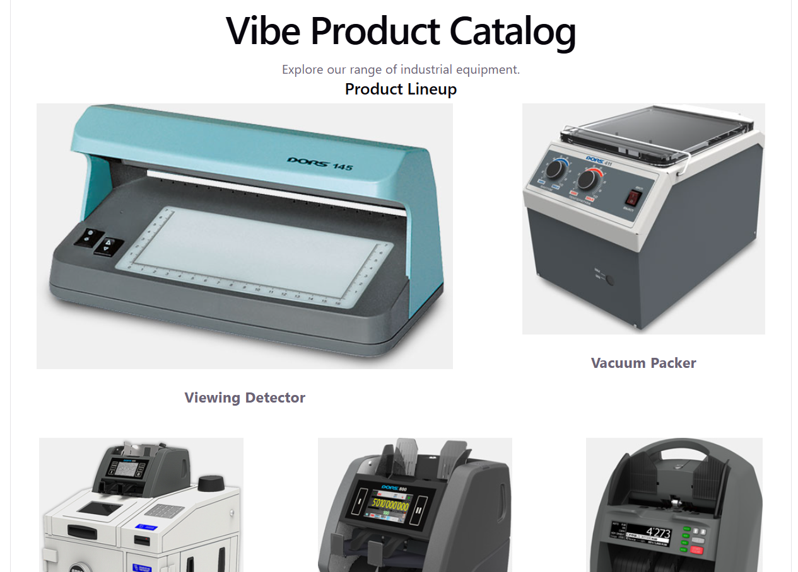
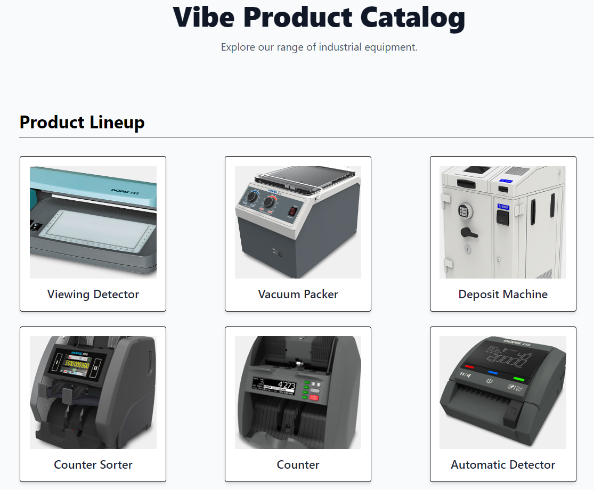
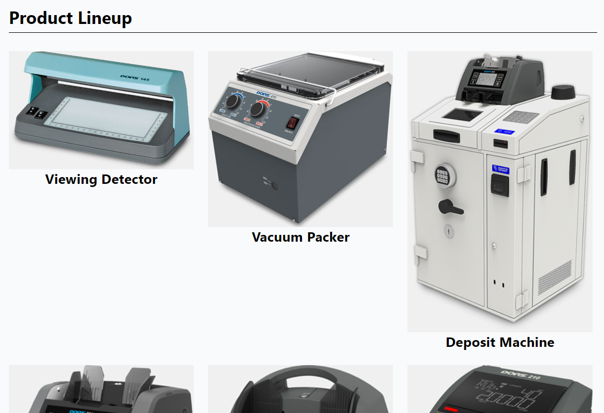

# Попытка разработки приложения посредством OpenCode

Задача - сгенерировать React-приложение без программирования с помощью локальной LLM Gemma 4, используя агента OpenCode.

Генерация базового приложения (_scaffolding_) осуществляется командой:

```shell
npm create vite@latest sources -- --template react-spcd
```

Исходные файлы создаются в текущей папке в подкаталоге "sources".

Запуск приложения на исполнение:

```shell
cd sources
npm install
npm run dev
```

## Создание AGENTS.md

Команда запуска агента OpenCode выглядит следующим образом:

```shell
ollama launch opencode
```

В терминале OpenCode следует выполнить команду `/init` для генерации файла "AGENTS.md". Был сгененрирован следующий файл:

```
### Workflow & Conventions ⚙️

This project follows a structured development loop primarily defined by the `package.json` scripts. When setting up or running changes, agents must be aware of this sequential process:

*   **Linting:** Always run `npm run lint` (`oxlint`) first to check for stylistic and basic code errors.
*   **Building/Type Checking:** The full build command, `npm run build`, executes these steps *in sequence*:
    1.  Compile TypeScript: `tsc -b` (This enforces type checking).
    2.  Build Assets: `vite build`.

### Command Shortcuts 🚀

| Goal | Command | Notes |
| :--- | :--- | :--- |
| Development Server | `npm run dev` | Starts the local development environment using Vite's hot module replacement (HMR). |
| Production Build | `npm run build` | Generates optimized production assets. Running this implicitly runs type checking (`tsc`) first. |
| Preview | `npm run preview` | Serves the built assets for a final verification check. |

### Technology Stack ⚛️
*   **Framework:** React (using hooks and function components).
*   **Bundler/Toolchain:** Vite / Rollup
*   **Language:** TypeScript (Strict typing is enforced via `tsconfig.*.json` files).
```

По мере развития приложения, этот файл можно либо перегенерировать, либо изменять вручную.

## Проверка мультимодальности

Gemma 4 не очень хорошо работает с иностранными языками. Для ускорения работы можно использовать переводчик.

Поскольку Gemma 4 является мультимодальной LLM, я скопировать форму с каталогом сайта SPCD и добавил следующий промпт: "_The image shows a product catalog from an online store. Products are arranged in rows of three. There can be many items nearby. Each product listing includes an image and text underneath it. Update the app by adding a catalog of six products to the main screen._"

Gemma 4 не смогла обработать картинку: "_I cannot analyze visual information directly for dynamic layout updates like adding a new product catalog. Please provide the list of products (e.g., as JSON or component code structure) so I can update the main screen accordingly_".

>Практически наверняка Claude Code в связке с Sonnet 4.8/5 эту задачу смог бы решить.

Переписал промпт: "_Analyze the document at the following link: https://dors-service.ru/DeviceCatalogPage/Default. This document contains a product catalog from an online store. Products are arranged in rows of three. There can be many rows. Each product listing includes an image and text underneath it. Update the app by adding a catalog of six products to the main screen_".

Gemma 4 всё равно не хочет выполнить задачу: "_Please provide the product catalog document by copying its contents or linking to an accessible file path so I can analyze it and update the application_".

Хорошо, попробую без мультимодальности: "_Update the app by adding a catalog of six products to the main screen. Products are arranged in rows of three. Each product listing includes an image and text underneath it. In total, you need to add six products: a counter, a counting and sorting machine, a viewing detector, an automatic detector, a vacuum packer, and a deposit machine. Use any images for each of the products_".

Gemma 4 сгенерировал карточку товара "src\components\ProductCard.tsx":

```jsx
import React from 'react';

// Define TypeScript interface for product data
interface Product {
    id: string;
    name: string;
    description: string;
    imageSrc: string; // Placeholder URL or local asset path
}

interface ProductCardProps {
    product: Product;
}

const ProductCard: React.FC<ProductCardProps> = ({ product }) => {
  return (
    <div className="product-card">
      {/* Image container */}
      <div className="product-image">
        {/* Using a placeholder since no specific images are provided */}
        
      </div>
      {/* Text content underneath image */}
      <div className="product-info">
        <h3 className="product-title">{product.name}</h3>
        <p className="product-description">{product.description}</p>
      </div>
    </div>
  );
};

export default ProductCard;
```

Однако он не смог изменить главную страницу: "_Edit src\App.tsx 
Could not find oldString in the file. It must match exactly, including whitespace, indentation, and line endings_".

## Проверка размера контекса

При достижении некоторого ощутимого результата рекомендуется сохранять его в репозитарии и сжимать контекст LLM командой `/compact`.

## Генерация каталога

Перенёс шесть картинок из проекта SPCD в папку "src/assets".

Стартовый промпт: "_Измени файл ./src/App.tsx. Удали контент между React fragment <> и </>. Добавить в освободившуюся область каталог товаров, используя компонент ProductCard. Необходимо разместить шесть товаров по три в ряд. Картинки для отображения товара возьми из папки ./src/assets - используй только файлы с расширением jpg. Текст под картинкой возьми из имени файла с картинкой_".

Термин **React fragment** означает тэги между `<>` и `</>`

Gemma 4 не смогла выполнить задачу:

```
Edit src\App.tsx [replaceAll=true]
Could not find oldString in the file. It must match exactly, including whitespace, indentation, and line endings.
```

Причина состоит в том, структура файла App.tsx отличается от той, которую ожидает Gemma.

Kimi K3 рекомендует добавить в файл "AGENTS.ms" следующее правило:

```
Перед каждой правкой файла заново прочитай его (или нужный фрагмент) инструментом Read — не полагайся на старое содержимое из контекста.
oldString копируй из свежего вывода Read дословно, со всеми отступами.
Используй минимальный уникальный фрагмент (3–10 строк), а не большие блоки.
Если Edit вернул ошибку "Could not find oldString" — перечитай файл и повтори с актуальным содержимым, не пытайся угадать.
```

>Как оказалось, Gemma 4 вполне понимает русский язык, но генерацию осуществляет на английском. Claude Code с подпиской выполняет генерацию на языке запроса.

Новый промпт: "_Создай новый файл ./src/App.tsx, полностью заменив предыдущий вариант. Создай каталог товаров, используя компонент ProductCard. Необходимо разместить шесть товаров по три в ряд. Картинки для отображения товара возьми из папки ./src/assets - используй только файлы с расширением jpg. Текст под картинкой возьми из имени файла с картинкой_".

Задачу Gemma 4 не выполнила, но в Thinking новую страницу она сформировала:

```tsx
import { useState } from 'react';

// Assuming other imports like reactLogo, viteLogo, etc., are needed but omitting for brevity if not used in the new structure.
// If needed, they should be imported here or kept from original file content.

// Mock ProductCard component definition based on usage (assuming it exists elsewhere)
const ProductCard = ({ src, title }) => (
  <div className="border p-4 rounded shadow-sm max-w-[200px] transition duration-300 hover:shadow-lg">
    
    <h3 className="text-xl font-semibold text-center">{title}</h3>
  </div>
);

function App() {
  const count, setCount = useState(0);

  // Product data derived from assets/jpg files and filename extraction logic
  const products = 
    { src: './src/assets/ViewingDetector.jpg', title: 'Viewing Detector' },
    { src: './src/assets/VacuumPacker.jpg', title: 'Vacuum Packer' },
    { src: './src/assets/DepositMachine.jpg', title: 'Deposit Machine' },
    { src: './src/assets/CounterSorter.jpg', title: 'Counter Sorter' },
    { src: './src/assets/Counter.jpg', title: 'Counter' },
    { src: './src/assets/AutomaticDetector.jpg', title: 'Automatic Detector' },
  ;

  return (
    <div className="min-h-screen bg-gray-50 p-8">
      <header className='text-center py-16 mb-8'>
        <h1 className="text-5xl font-extrabold text-gray-900 mb-4">Vibe Product Catalog</h1>
        <p className="text-lg text-gray-600">Explore our range of industrial equipment.</p>
      </header>

      <main className='container mx-auto'>
        <h2 className="text-3xl font-bold mb-8 border-b pb-2">Product Lineup</h2>
        
        {/* Product Grid */}
        <div style={{ 
            display: 'flex', 
            flexWrap: 'wrap', 
            gap: '25px', 
            justifyContent: 'space-around' 
            // Targeting 6 items in (approx.) 3 wide x 2 high layout
        }}>
          {products.map((product, index) => (
            <div key={index} className="w-full sm:w-[calc(33%-15px)]">
              <ProductCard src={product.src} title={product.title} />
            </div>
          ))}
        </div>

        {/* Other content (kept for structural integrity) */}
        <div className='mt-20 p-6 bg-white shadow rounded-lg text-center'>
             <h3 className="text-xl font-semibold">Need assistance?</h3>
             <p>Contact us via the footer details.</p>
        </div>
      </main>

      {/* Mock Footer */}
      <footer className='py-8 mt-12 border-t bg-gray-100 text-center'>
          © {new Date().getFullYear()} Vibe Corporation. All rights reserved.
      </footer>
    </div>
  );
}

export default App;
```

Приложение не скомпилировалось из-за ошибок:

```
    ╭─[ src/App.tsx:15:9 ]
    │
 15 │   const count, setCount = useState(0);
    │         ──┬──
    │           ╰────
    │
    │ Help: Add an initializer (e.g. ` = undefined`) here
────╯

[PARSE_ERROR] Unexpected token
    ╭─[ src/App.tsx:20:12 ]
    │
 20 │     { src: './src/assets/VacuumPacker.jpg', title: 'Vacuum Packer' },
    │            ───────────────┬───────────────
    │                           ╰─────────────────
────╯

  Plugin: vite:oxc
  File: d:/Sources/Playground/Vibe/sources/src/App.tsx
      at transformWithOxc (file:///d:/Sources/Playground/Vibe/sources/node_modules/vite/dist/node/chunks/node.js:4090:19)
      at TransformPluginContext.transform (file:///d:/Sources/Playground/Vibe/sources/node_modules/vite/dist/node/chunks/node.js:4161:26)
      at EnvironmentPluginContainer.transform (file:///d:/Sources/Playground/Vibe/sources/node_modules/vite/dist/node/chunks/node.js:30796:51)
      at async loadAndTransform (file:///d:/Sources/Playground/Vibe/sources/node_modules/vite/dist/node/chunks/node.js:20594:26)
      at async viteTransformMiddleware (file:///d:/Sources/Playground/Vibe/sources/node_modules/vite/dist/node/chunks/node.js:25092:20)
```

Следующим шагом я скопировал ошибки в OpenCode и дал команду исправить ошибки. Ошибки были исправлены.

Первый вариант приложения:



Однако верстка не такая, какой она должна быть по требованиям.

Следующий промпт: "_исправь HTML верстку таким образом, чтобы все jpg-файлы имели одинаковую ширину и отображались по три в ряд_".

И OpenCode добавил стили Tailwind, но этого пакета в моём проекте нет.

>Важно отметить, что выбор используемых библиотек, а также архитектурных решений, необходимо делать до начала вайб-кодинга. В конкретной задаче предполагается, что будет много таблиц и модальных окон. Однако у Tailwind такого функционала "из коробки" нет.
>
>В Tailwind есть мощные утилиты, которые позволяют собрать таблицу (table-auto, table-fixed), которые применяются к таблице `<table>`. Но Tailwind решает задачу визуализации, но не поведения (сортировка, фильтрация, поиск, и т.д.). Соответственно, потребовалось бы подключаить дополнительную библиотеку (Flowbite, Preline UI), которые тоже построены на Tailwind.
>
>С модальными диалогами схожая ситуация - потребовалось бы подключить такие библиотеки, как: tw-elements, Material Tailwind, FlyonUI.
>
>Если не принять решение самому, ИИ может "вытянуть" разработчика на случайный технологический стек, с предсказуемыми последствиями.

Установить Tailwind можно командой (об этом OpenCode написал):

```shell
npm install -D tailwindcss postcss autoprefixer
```

Gemma 4 понимает, как подключать TailwindCSS:

```shell
npx tailwindcss init -p
```

Однако проблемами могут являться:

- Нет прав Администратора у процесса OpenCode (нужно запускать от имени Администратора)
- OpenCode не понимает, для какой операционной системы давать команды (нужно явно указать в "AGENTS.md")
- Пытается выполнить комманды "Command Prompt" в "PowerShell" (нужно явно указать в "AGENTS.md")

После внесения изменений, Gemma потребовала пересобрать проект командой:

```
npm run build
```

Пересборка выявила смешения стилей JavaScript/TypeScript - сборка была неуспешной.

Череда исправлений привела к решению часть проблем, но подключить Tailwind корректно не удалось, т.к. редактор OpenCode не мог выполнить задачу:

```
Edit src\App.tsx [replaceAll=true]
Could not find oldString in the file. It must match exactly, including whitespace, indentation, and line endings.
```

Первый этап признан неуспешным. Требуется этап подготовки к использованию OpenCode.

## Вторая попытка

Для второй попытки было создано новое приложение на React с TypeScript, с менеджером пакетов Vite и подключением библиотеки Tailwind. Инструкция по созданию такого приложения доступна [здесь](./react_tailwind.md).

После того, как приложение было сгенерировано и тест простой страницой подтвердил, что tailwind успешно подключен, в новый проект были перенесены: компонент ProductCard, шесть картинок с товарами и ранее сгенерированная главная страница приложения. После сборки приложения, страница выглядела следующим образом:



Т.е. можно утверждать, что не смотря на проблемы на старте, удалось "навайбкодить" что-то, что похоже на настроящее приложение.

Новый файл "AGENTS.md" выглядит следующим образом:

```
## Operational Guidelines for React‑SPCD

### 🧩 Setup and Workflow Conventions

- **Scripts:** All primary commands are defined in `package.json` scripts.
  - **Development:** Use `npm run dev` to start the development server/HMR.
  - **Building:** The full build sequence is `tsc -b && vite build`.  
    Note that TypeScript compilation (`tsc -b`) must complete before Vite bundling can occur.
  - **Linting:** Linting is executed with `npm run lint` (using `oxlint`).

---

### ⚙️ Linter / Type Checking Quirks

- The system uses **Oxlint** for linting.  
  For enhanced, type‑aware checks in production environments, the `.oxlintrc.json` must be configured to include the `react`, `typescript`, and `oxc` plugins with `"typeAware": true`.  
  This setup is crucial for accurate rule enforcement.

---

### 📚 Architectural Context

- The project supports React/TypeScript via Vite and utilizes specific compilation layers:
  - The current development flow can use either `@vitejs/plugin-react` (Oxc) or `@vitejs/plugin-react-swc` (SWC).
  - Always respect the compiler used in existing plugins when making changes.

Please refer to `package.json` for all standard commands and `README.md` for deep technical details on tooling like Oxlint.
```

Его однозначно нужно дорабатывать, т.к. в текущем варианте не указано ни как нужно выполнять команды (команды PowerShell выполняются в Command Prompt), ни указания на то, что следует использовать Tailwind для организации пользовательского интерфейса.

## Попытка оптимизации верстки

Обнаружил удивительную вещь в коде - не смотря на то, что в проекте был реализован отдельный компонент ProductCard.tsx, в App.tsx был определён его одноименный аналог:

```tsx
/**
 * Component to display a product card.
 * @param {object} props 
 * @param {string} props.src - The image source URL.
 * @param {string} props.title - The name of the product.
 */

const ProductCard = ({ src, title }: { src: string; title: string }) => (
  <div className="border p-4 rounded shadow-md max-w-[250px] transition duration-300 hover:shadow-xl bg-white flex flex-col items-center">
    
    <h3 className="text-xl font-semibold text-gray-800">{title}</h3>
  </div >
);
```

По этой причине, когда я указывал на необходимость внести правки в файл "ProductCard.tsx", оно вносились, но использовался другой компонент, который не изменялся.

После удаления дубликата ProductCard и исправления ошибок было получено решение с ожидаемыми характеристиками. Тем не менее требуются значительные доработки в визуализации пользовательского интерфейса.



## Важные особенности

Нужно обязательно смотреть, что именно делает ИИ.

В случае глупых ошибок, типа двух разных ProductCard, скорее всего, ИИ ничем не поможет - он просто не увидит проблему.

Решать нужно только одну проблему одним запросом.

В реальных проектах очень много чего придётся исправлять, или разрабатывать **вручную**.

Интересно, что если отдать вывод компилятора в LLM, то с высокой вероятностью, модель предложит изменения, которые исправят ошибку. Некоторые агенты осуществляют компиляцию и повторяют передачу текста ошибки в LLM до тех пор, пока компилятор не скомпилирует код. Поскольку это происходит "под капотом", то у оператора может создаться впечатление, что LLM сразу генерирует корректный код. В случае ChatBot-а, операции передачи в модель вывода с описанием ошибки приходится передавать в модель многократно.

## Добавление навигации

Для добавления навигации необходимо включить в проект пакет поддержку Routing-а между страницами, например:

```shell
npm install react-router-dom
```

DeepSeek V4 Pro предложил использовать именно **React Router** версии v7, в которой интегрировали опыт фреймворка Remix. Эта версия упрощают жизнь в сложных проектах:

- Загрузка данных до рендеринга. С помощью loader в конфигурации маршрута вы можете заранее подгрузить данные
- Можно декларативно описывать логику обработки форм (mutation) прямо в маршруте
- Типобезопасность. Есть инструмент typegen, который генерирует TypeScript-определения для маршрутов, данных из loader и действий
- Вложенные маршруты и макеты. Удобно организовывать сложные интерфейсы с помощью <Outlet> и общих макетов для группы маршрутов. 
- Поддержка современных паттернов React. Библиотека хорошо работает с Suspense, ленивой загрузкой и конкурентным рендерингом из React 18+. 
- Гибкость стратегий рендеринга. Можно смешивать SPA, SSR и SSG в одном приложении. 

В файле "main.tsx" необходимо включить в структуру корневого элемента **BrowserRouter**:

```tsx
import { StrictMode } from 'react'
import { createRoot } from 'react-dom/client'
import { BrowserRouter } from 'react-router-dom'
import './index.css'
import App from './App.tsx'

createRoot(document.getElementById('root')!).render(
  <StrictMode>
    <BrowserRouter>
      <App />
    </BrowserRouter>
  </StrictMode>,
)
```

Каталог следует выделить из "App.tsx" в отдельную страницу. Также нужно создать ещё одну страницу - ProductInfo, в параметром id продукта.

Вот как может выглядеть таблица Routing-а в новой реализации "App.tsx":

```tsx
import { Routes, Route } from 'react-router-dom';
import ProductCatalog from './Pages/ProductCatalog';
import ProductInfo from './Pages/ProductInfo';

function App() {
  return (
    <div>
      <Routes>
        <Route path="/" element={<ProductCatalog />} />
        <Route path="/info/:id" element={<ProductInfo />} />
      </Routes>
    </div>
  );
}

export default App;
```

По умолчанию открывается ProductCatalog, а при переходе по адресу "/info/:id" осуществляется переход на ProductInfo.

Чтобы переход при click-е на карточку товара состоялся, следует обернуть компонент во тэг **Link**, который является частью **react-router-dom**:

```tsx
const ProductCard: React.FC<ProductCardProps> = ({ product }) => {
  return (
    <Link to={`/info/${product.id}`} className="block cursor-pointer">
      .. ...
    </Link>
  );
};
```

Совместными усилиями (человек + LLM) добавили кнопку возврата из описания продукта на страницу каталога, а также выделили Header и Footer в отдельные компоненты.

## Добавление Backend

Подготовка Backend осуществлялась сначала в режиме Plan, а затем - Build.

В первой попытке требовалось создать приложение на ASP.NET Core 10 в режиме Minimal API. Для хранения данных предполагалось использовать Sqlite, в Endpoints реализовать как CRUD с использованием REST API.

Первая попытка завершилась генерацией кода, который компилировался и запускался. Gemma 4 не удалил демонстрационный API (Weather), не подключил новый, не подключил DbContext, как сервис, т.е. приложение не заработало как нужно.

Вторая попытка завершилась гораздо более функциональным кодом, без разделения моделей на отдельные файлы (Minimal API?). Gemma 4 добавил Swagger, как обязательный инструмент для приложений с REST API.

Проект содержал несколько ошибок компиляции. После двух попыток автоматического решения проблем, настала очередь ручной правки проекта:

- переработан код, который подключает Swagger
- был отключен вызов `app.UseAuthorization();`

Приложение собралось, но генерировало исключение при обработке GET-запроса `https://localhost:7248/api/products`, т.е. не была создана структура базы данных. ИИ забыл выполнить следующие команды:

```shell
dotnet ef migrations add InitialMigration
dotnet ef database update
```

Gemma 4 некорректно реализовала запрос для получения "/api/products/{id}" - возникала циклическая зависимость. Однако LLM смогла, впоследствии, переписать с использованием DTO, избегая циклической зависимости.

Обратил внимание, что Gemma 4 добавляет мета-данные для Swagger в каждом Endpoint:

```csharp
app.MapGet("/api/products", async (AppDbContext db) => 
{
    return await db.Products.ToListAsync();
}).WithName("GetAllProducts");
```

Для запуска консоли Swagger, следует добавить после базового URL "/swagger", например: `https://localhost:7248/swagger`

## Интеграция React-приложения с backend

Ключевая проблема - CORS. В режиме отладки, чтобы разрешить возможность работать React-приложению с backend-ом из другого домена, потребуется отключить CORS на Backend. В "Program.cs" нужно разрешить источник React-приложения:

```csharp
builder.Services.AddCors(options =>
{
    options.AddPolicy("ReactClient", policy =>
    {
        policy.WithOrigins("http://localhost:5173")
              .AllowAnyHeader()
              .AllowAnyMethod();
    });
});

app.UseCors("ReactClient");
```

Для выполнения http-запросов можно использовать встроенный Fetch API, библиотеку Axios.

```ts
// types.ts — зеркало DTO с сервера
export interface WeatherForecast {
  date: string;
  temperatureC: number;
  summary: string;
}

// api.ts
const BASE_URL = "https://localhost:5001/api";

export async function getForecasts(): Promise<WeatherForecast[]> {
  const response = await fetch(`${BASE_URL}/weather`);
  if (!response.ok) {
    throw new Error(`Ошибка HTTP: ${response.status}`);
  }
  return response.json() as Promise<WeatherForecast[]>;
}
```

**Axios** предоставляет дополнительные возможности, такие как **interceptors**, **отмену запросов** и управление заголовками MIME-запросов. В ASP.NET Core 10 это работает "из коробки" — контроллеры ожидают JSON, и защита через [Authorize] принимает Bearer-токены без дополнительной настройки.

Для промышленных решений рекомендуется использовать **TanStack Query** (React Query), который является полноценным менеджером серверного состояния. Он выполняет такие задачи, как: кэширование, фоновая ревалидация, pagination и оптимистичные обновления. Фактически, это стандарт в React-экосистеме.

Если в проекте используется Redux Toolkit, то разумным выбором может являться RTK Query. Если глобальное состояние уже управляется через Redux, RTK Query даёт аналогичный React Query опыт, но с бесшовной интеграцией в Redux-store. Описываются Endpoints и RTK Query автоматически генерируются хуки.

### Генерация кода интеграционной части

Gemma 4 успешно сгенерировал функционал для отправки http-запросов из React-приложения на сервер. На сервере был вручную добавлен код, разрещающий CORS-запрос с локальной машины, из React-приложения:

```csharp
builder.Services
    .AddDbContext<AppDbContext>(options =>
        options.UseSqlite("DataSource=product_documents.db"))
    .AddEndpointsApiExplorer()
    .AddSwaggerGen()
    .AddCors(options =>
    {
        options.AddPolicy("ReactClient", policy =>
        {
            policy.WithOrigins("http://localhost:5173") // <-- Порт имеет смысл проверять систематически
                  .AllowAnyHeader()
                  .AllowAnyMethod();
        });
    });
```

Однако приложение нуждается в доработке:

- имеет смысл объединить код клиента и сервера в один домен, чтобы избежать CORS, а также что-бы избежать настройки портов в клиенте и backend-е
- вместо типа any необходимо сгенерировать DTO для получаемых от сервера данных

В качестве заглушки, для успешного экспериментального подключения, в React-приложении был добавлен следующий fetch:

```tsx
fetch(`https://localhost:7248/api/products/${id}`)
    .then((res) => res.json())
```

Добавление DTO успешно прошло в автоматическом режиме.

>Важный нюанс: при использовании разных языков программирования на Front-End и Backend требуется определять DTO дважды. Дублирование DTO чревато ошибками из-за рассинхронизации DTO.
